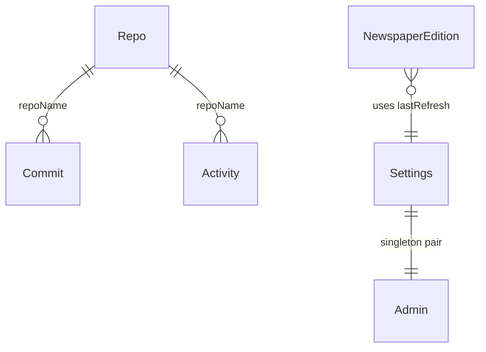

# Tremors Portfolio - Developer Documentation

> Comprehensive documentation for developers working on Tremors Portfolio.

**Version:** 2.3.4 | **Last Updated:** 2026-03-03

---

## Table of Contents

- [Architecture Overview](#architecture-overview)
- [Project Structure](#project-structure)
- [Naming Conventions](#naming-conventions)
- [Database Schema](#database-schema)
- [API Reference](#api-reference)
- [Environment Variables](#environment-variables)
- [Configuration](#configuration)
- [Security Practices](#security-practices)
- [Error Handling](#error-handling)
- [Testing](#testing)
- [Deployment](#deployment)
- [Project Auditing & Quality Standards](#project-auditing--quality-standards)
- [Troubleshooting](#troubleshooting)

---

## Architecture Overview

Tremors Portfolio follows a **Modern Full-Stack Next.js** architecture:

```mermaid
graph TD
    A[Frontend (Next.js App Router, React 19, Tailwind 4)] -->|Server Actions / API Calls| B[Backend (Node.js API Routes)]
    B -->|Prisma Requests| C[Database (PostgreSQL / NeonDB)]
    B -->|Data Sync| D[External APIs (GitHub, Gemini)]
```

The project is organized with:
- **Frontend**: React Server Components (RSC) for performance, Client Components for interactivity (Terminal, Resume editing).
- **Backend**: API routes for admin actions and data fetching (GitHub sync, AI generation).
- **Database**: Relational data model for caching GitHub stats and storing site settings.

### Key Design Decisions

| Decision | Rationale |
|----------|-----------|
| **Next.js App Router** | Leverages React Server Components for zero-bundle-size data fetching. |
| **Prisma ORM** | Type-safe database access and easy migrations. |
| **Custom Auth** | Lightweight PBKDF2/HMAC implementation avoids complex auth provider dependencies for a single-user app. |
| **Tailwind CSS 4** | Zero-runtime CSS-in-JS performance with utility-first reliability. |

---

## Project Structure

```
tremors/
├── app/
│   ├── src/
│   │   ├── app/              # App Router Pages & API
│   │   ├── components/       # Reusable React components
│   │   ├── config/           # Centralized configuration (site.ts)
│   │   ├── lib/              # Core logic (auth, db, github)
│   │   ├── hooks/            # Custom React hooks
│   │   └── types/            # TypeScript definitions
│   ├── prisma/               # Database schema
│   ├── public/               # Static assets
│   ├── .env.example          # Template for environment variables
│   └── next.config.ts        # Next.js configuration
├── README.md                 # User-facing documentation
├── DEVELOPMENT.md            # This file
├── CHANGELOG.md              # Version history
├── TASKS.md                  # Implementation tasks and backlog
└── LICENSE.md                # License terms
```

---

## Naming Conventions

> Names should be self-documenting. A reader should understand what a file, function, or component does without opening it.

### Files & Directories

| Type | Convention | Example |
|------|-----------|------------------|
| **Pages / Routes** | `kebab-case` directory | `app/news/page.tsx`, `app/resume/page.tsx` |
| **Components** | `PascalCase.tsx` | `ProjectCard.tsx`, `SpotlightSection.tsx` |
| **Hooks** | `camelCase` with `use` prefix | `useFetch.ts`, `useTerminalAdmin.ts` |
| **Utilities / Lib** | `camelCase.ts` | `auth.ts`, `github.ts`, `date.ts` |
| **Config** | `camelCase.ts` | `site.ts` |
| **Tests** | `snake_case.test.ts` | `api_refresh.test.ts`, `auth.test.ts` |
| **API Routes** | `kebab-case/route.ts` | `api/admin/refresh/route.ts` |

### Functions & Methods

| Prefix | Purpose | Example |
|--------|---------|---------|
| `get` / `fetch` | Retrieve data | `getGitHubData()`, `fetchRepos()` |
| `set` / `update` | Modify state | `setAdminCookie()`, `updateSettings()` |
| `verify` / `validate` | Validation | `verifyAdminCookie()`, `validateCsrf()` |
| `handle` | Event handler | `handleRefresh()`, `handleLogin()` |
| `format` / `parse` | Transform | `formatProjectTitle()`, `parseTopics()` |
| `clear` / `delete` | Remove | `clearAdminCookie()` |

### Database Models & Fields

| Type | Convention | Example |
|------|-----------|---------|
| **Models** | `PascalCase` singular | `Repo`, `Settings`, `NewspaperEdition` |
| **Fields** | `camelCase` | `pushedAt`, `isActive`, `passwordHash` |
| **IDs** | `id` (auto) or `cuid()` | `Repo.id` (Int), `NewspaperEdition.id` (String/cuid) |

---

## Database Schema

### Models Overview (5 total)

| Model | Purpose | Key Fields |
|-------|---------|------------|
| **Repo** | Caches GitHub repository data | `id`, `name`, `stars`, `topics`, `hidden` |
| **Settings** | Global site configuration | `availableForWork`, `resumeSummary` |
| **Admin** | Single-user admin authentication | `passwordHash` |
| **NewspaperEdition** | AI-generated news content | `headline`, `bodyContent`, `generatedBy`, `agentName`, `personality` |
| **Activity/Commit** | Caches GitHub history | `sha`, `message`, `date` |

### Relationships



> Note: Relationships are logical (via `repoName` string matching), not enforced via foreign keys. This keeps the schema flexible for GitHub API data.

### Migrations

```bash
# Run pending migrations
npx prisma migrate deploy

# Create a new migration
npx prisma migrate dev --name describe_change

# Reset database (destructive)
npx prisma migrate reset

# Generate Prisma Client after schema changes
npx prisma generate
```

### Indexes

| Table | Column(s) | Type | Purpose |
|-------|-----------|------|---------|
| `Repo` | `featured` | B-tree | Optimized featured project filtering |
| `Repo` | `hidden` | B-tree | Optimized visibility filtering |
| `Repo` | `fullName` | Unique | Upsert key for GitHub sync |
| `NewspaperEdition` | `date` | B-tree | Date-range queries for editions |
| `Activity` | `date` | B-tree | Date-range queries for activity feed |

---

## API Reference

### Authentication

| Detail | Value |
|--------|-------|
| **Method** | Session Cookie (HMAC-signed token) |
| **Cookie** | `admin_session` (httpOnly, Secure, SameSite=Lax) |
| **Lifetime** | 24 hours |
| **CSRF** | Origin/Referer header validation on all mutating requests |

### Rate Limiting

| Route Pattern | Limit | Window |
|---|---|---|
| `/api/auth/*` | 5 requests | 15 minutes |
| `/api/admin/*` | 30 requests | 1 minute |
| `/api/newspaper/generate` | 10 requests | 1 minute |
| `/api/stats/commits` | 20 requests | 1 minute |
| `/api/newspaper/editions` | 30 requests | 1 minute |
| All other API routes | 100 requests | 1 minute |

Headers: `X-RateLimit-Limit`, `X-RateLimit-Remaining`, `X-RateLimit-Reset`

### Endpoints

#### Authentication

| Method | Path | Auth | Description |
|--------|------|------|-------------|
| `POST` | `/api/auth` | No | Login with admin secret or password |
| `GET` | `/api/auth/check` | No | Check current session validity |
| `POST` | `/api/auth/logout` | Admin | Clear admin session |

#### Admin

| Method | Path | Auth | Description |
|--------|------|------|-------------|
| `POST` | `/api/admin/refresh` | Admin | Sync GitHub data to database |
| `GET` | `/api/admin/repos` | Admin | List all repos with admin fields |
| `PATCH` | `/api/admin/repos` | Admin | Update repo visibility/featured/order |
| `POST` | `/api/admin/repos/reorder` | Admin | Batch reorder repos |
| `PATCH` | `/api/admin/availability` | Admin | Toggle "available for work" |
| `GET` | `/api/admin/settings` | Admin | Get site settings |
| `PATCH` | `/api/admin/settings` | Admin | Update site settings |
| `POST` | `/api/admin/resume` | Admin | Upload resume PDF to Vercel Blob |
| `POST` | `/api/newspaper/generate` | Admin | Generate new AI newspaper edition |

#### Public

| Method | Path | Auth | Description |
|--------|------|------|-------------|
| `GET` | `/api/stats/commits` | No | Commit counts per visible repo |
| `GET` | `/api/newspaper/active` | No | Get today's active newspaper edition |
| `GET` | `/api/newspaper/editions` | No | List recent editions |
| `GET` | `/api/news/rss` | No | RSS feed of newspaper editions |

---

## Environment Variables

> [!CAUTION]
> Never commit `.env` files. Use `.env.example` with placeholder values and ensure `.env` is listed in `.gitignore`.

### Required

| Variable | Description | Example |
|----------|-------------|---------|
| `GITHUB_USERNAME` | Your GitHub profile to sync | `qtremors` |
| `ADMIN_SECRET` | Secret command for terminal login (Change in production!) | `my_secret_login` |
| `DATABASE_URL` | Postgres connection string (Pooled) | `postgresql://...` |
| `DATABASE_URL_UNPOOLED` | Postgres connection string (Unpooled direct connection) | `postgresql://...` |

### Optional

| Variable | Description | Default |
|----------|-------------|---------|
| `GITHUB_TOKEN` | GitHub PAT for higher rate limits | - |
| `AUTH_SECRET` | Signing key for sessions | Auto-generated |
| `GEMINI_API_KEY` | Google AI Studio key for News generation | - |
| `NEXT_PUBLIC_URL` | Alternative site URL used for CSRF protection | - |
| `NEXT_PUBLIC_SITE_URL` | Canonical URL for SEO/RSS | `http://localhost:3000` |
| `NEXT_PUBLIC_CONTACT_EMAIL` | Contact email address used in portfolio | - |
| `NEXT_PUBLIC_LINKEDIN_URL` | LinkedIn profile URL used in portfolio | - |
| `ADMIN_PASSWORD` | Pre-hashed admin password. Leave empty — set automatically on first login. | Auto-set |
| `BLOB_READ_WRITE_TOKEN` | Vercel Blob access token for Resume uploads | - |

---

## Configuration

### Security (next.config.ts)

| Setting | Default | Description |
|---------|---------|-------------|
| `Content-Security-Policy` | Strict | Blocks inline scripts/styles (except where needed) and limits sources. |
| `X-Frame-Options` | DENY | Prevents clickjacking. |

---

## Security Practices

### Input Validation & Sanitization
- All user input is validated at the **API route handler** level.
- Edge runtime execution for critical middleware components (rate limiting, basic auth verification).

### Authentication & Authorization
- Authentication method: **Session Cookie via JWT-like derived signatures**
- Session / token storage: **httpOnly, Secure Cookies**
- Role-based access control: **Single Admin User (Binary validation via password hash)**

### Sensitive Data Handling
- Secrets are loaded exclusively from environment variables.
- Passwords are hashed using **PBKDF2/HMAC-SHA256**.
- Signing secrets incorporate runtime entropy or rely strictly on heavily keyed predefined secrets.

### CORS Policy

| Setting | Value |
|---------|-------|
| **Allowed origins** | Same-origin only (enforced via CSRF middleware) |
| **Credentials** | httpOnly cookies (not exposed to JavaScript) |

### Dependency Auditing

```bash
# Check for known vulnerabilities
npm audit

# Auto-fix where possible
npm audit fix
```

---

## Error Handling

### Server-Side

| Layer | Strategy |
|-------|----------|
| **Route handlers** | `try/catch` with standardized JSON error responses (`{ success: false, error: "..." }`) |
| **Middleware** | Rate limiting returns `429` with `Retry-After` header |
| **Database** | Transaction rollback on failure (`prisma.$transaction`), connection retry via Prisma |
| **External services** | Graceful fallback (e.g., newspaper falls back to last edition if Gemini fails) |

### Client-Side

| Layer | Strategy |
|-------|----------|
| **API calls** | `useFetch` hook with automatic error toasts |
| **Forms** | Inline validation with toast notifications |
| **Global** | `<ErrorBoundary>` component in `layout.tsx` |

---

## Testing

### Running Tests

```bash
# All tests
npm run test

# Specific test file/module
npm run test src/__tests__/auth.test.ts
```

### Test Coverage

| Category | Coverage |
|----------|----------|
| `src/__tests__/auth.test.ts` | Verification of password hashing and session tokens |
| `src/__tests__/api-auth.test.ts` | Integration tests for authentication API endpoints |
| `src/__tests__/settings.test.ts` | Tests for global settings context and preferences |
| `src/__tests__/newspaper-*.test.ts` | Generation logic for AI newspaper editions |
| `src/__tests__/terminal-commands.test.ts` | Command parsing and execution logic |
| `src/__tests__/csrf.test.ts` | Validation logic for CSRF tokens |

There are 111 passing tests across 15 test files ensuring the core stability of the project backend paths.

---

## Deployment

### Vercel Deployment

1. **Connect GitHub**: Import the repository in Vercel.
2. **Database**: Add a Vercel Postgres (Neon) integration from the Storage tab.
3. **Blob Storage**: Add Vercel Blob from the Storage tab to handle Resume generation.
4. **Environment**: Add `GITHUB_USERNAME`, `ADMIN_SECRET`, and `GEMINI_API_KEY` in settings.
5. **Deploy**: Vercel will build and deploy cleanly.

```bash
# Production Build
npm run build
```

### Production Checklist

- [ ] Set `AUTH_SECRET` in environment variables.
- [ ] Configure `GEMINI_API_KEY` if using News feature.
- [ ] Verify `NEXT_PUBLIC_SITE_URL` aligns with your domain.
- [ ] Log in via terminal (`your_secret_command`) to set the initial password.

### Health Check

| Endpoint | Expected | Description |
|----------|----------|-------------|
| `GET /` | `200 OK` | Main page renders (dynamic, hits DB) |
| `GET /api/auth/check` | `200 OK` | API layer is responsive |

### Rollback

```bash
# Vercel: revert to previous deployment
vercel rollback

# Database: deploy previous migrations safely
npx prisma migrate deploy

# Revert changes by applying a new migration that undoes the schema change
# (Alternatively, use `prisma migrate resolve` to mark failed migrations)
# Important: Always take backups/snapshots and test restores before proceeding.
# Do NOT run `prisma migrate reset` in production as it destroys all data.
# Consider using point-in-time recovery via Neon/Postgres replicas for safe recovery.
```

---

## Project Auditing & Quality Standards

> A structured approach to ensuring the project is correct, secure, and maintainable.

### System Understanding

Before making significant changes, ensure a deep understanding of:
- **Core Architecture**: Workflows, data flow, and overall purpose.
- **Implicit Design**: Assumptions and hidden coupling between components (e.g. CSRF handling, Auth signing secrets).
- **Edge Cases**: Unintended behaviors and alternative use cases.

### Audit Categories

Evaluate changes and existing code against these dimensions:

| Category | Focus Areas |
|----------|-------------|
| **Correctness** | Logical errors, edge-case failures, silent failures, data integrity |
| **Security** | Vulnerabilities, auth flaws, input weaknesses, sensitive data exposure |
| **Performance** | Algorithm efficiency, query optimization, resource overuse (CPU/RAM) |
| **Architecture** | Bottlenecks, tight coupling, structural mismatches, scalability |
| **Maintainability** | Readability, naming consistency, technical debt, dead code |
| **Documentation** | Accuracy, completeness, implementation-spec matching |
| **Infrastructure** | Environment config, deployment risks, secret management |

### General Anomalies

Identify and resolve anything that is:
- **Confusing**: Inconsistent or unjustified logic.
- **Out of place**: Contextually surprising behavior.
- **Undocumented**: Implicit assumptions that aren't spelled out.

### Reporting Process

- All audit findings must be added to [TASKS.md](TASKS.md).
- Ensure entries are **Clear**, **Actionable**, and **Concisely described**.
- Avoid vague statements; provide concrete context and impact.

---

## Troubleshooting

### Common Issues

| Issue | Solution |
|-------|----------|
| **Database connection error** | Check `DATABASE_URL` matches your Neon/Postgres credentials. |
| **GitHub rate limit** | Add `GITHUB_TOKEN` to environment variables. |
| **Admin login fails** | Ensure cookies are enabled and `AUTH_SECRET` is consistent. |
| **Resume Upload fails** | Check if Vercel Blob has been instantiated and `BLOB_READ_WRITE_TOKEN` acts correctly. |
| **Timezone sync errors** | Evaluate if local vs Dockerized GMT offsets match assumed `+05:30` (IST) logic. |

### Debug Mode

Run locally with development logging enabled.

```bash
npm run dev
```

---

<p align="center">
  <a href="README.md">← Back to README</a>
</p>
